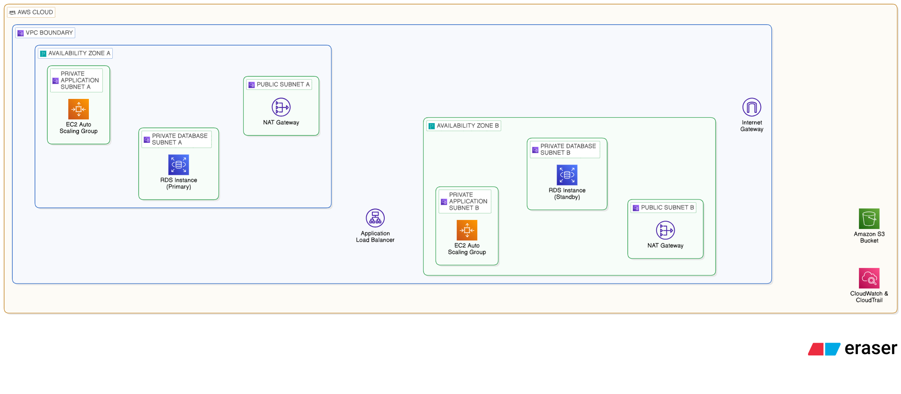

# Building a Scalable Cloud Infrastructure on AWS

This repository documents a secure, scalable, and highly available AWS deployment for a startup-style web application. It is structured so you can upload it directly to GitHub, then attach screenshots from your AWS Console as proof of work.

## Project Goals

- Build a 3-tier cloud architecture on AWS
- Keep internet-facing components isolated from private resources
- Improve availability with a Load Balancer and Multi-AZ database design
- Add monitoring, access control, logging, and operational documentation

## Repository Structure

```text
cloud-infrastructure-aws/
├── README.md
├── architecture/
│   └── README.md
├── configurations/
│   ├── security-groups.md
│   ├── iam-setup.md
│   ├── vpc-setup.md
│   ├── ec2-setup.md
│   ├── rds-setup.md
│   └── s3-setup.md
├── scripts/
│   ├── install_nginx.sh
│   └── user-data.sh
├── monitoring/
│   ├── cloudwatch-alarms.md
│   └── logging-setup.md
└── docs/
    ├── step-by-step-deployment.md
    ├── architecture-explanation.md
    └── troubleshooting.md
```

## Architecture Overview

This project follows a 3-tier architecture:

1. Presentation Layer: Application Load Balancer handles incoming user traffic.
2. Application Layer: EC2 instances in private subnets run the web application.
3. Data Layer: Amazon RDS stores relational data, while S3 is used for static files, backups, or exported logs.
   - 

## AWS Services Used

- Amazon VPC
- Public and private subnets
- Internet Gateway
- NAT Gateway
- Route Tables
- Security Groups
- EC2
- Application Load Balancer
- Auto Scaling Group
- Amazon RDS
- Amazon S3
- IAM
- CloudWatch
- CloudTrail

Optional extensions referenced in the docs:

- DynamoDB
- AWS Lambda
- Amazon SNS
- Amazon SQS

## Deployment Summary

### 1. Network Layer

Create a custom VPC, public subnets for the ALB, and private subnets for EC2 and RDS. Attach an Internet Gateway and configure a NAT Gateway for private outbound access.

### 2. Compute Layer

Launch EC2 instances in private subnets, install Nginx, and register the instances with an Application Load Balancer. Use an Auto Scaling Group if you want elasticity.

### 3. Database Layer

Deploy an RDS database in private subnets. Multi-AZ is recommended for better availability.

### 4. Storage Layer

Create an S3 bucket for files, backups, and log archives. Enable versioning, encryption, and lifecycle management.

### 5. Security Layer

Configure IAM users, groups, roles, MFA, and least-privilege access. Restrict traffic with Security Groups and subnet separation.

### 6. Monitoring and Logging

Use CloudWatch metrics, alarms, dashboards, and logs. Use CloudTrail for audit history.

## How Requests Flow

1. A user sends a request to the public DNS name of the Application Load Balancer.
2. The ALB forwards the request to a target group backed by EC2 instances in private subnets.
3. The application processes the request and reads or writes data through RDS.
4. Logs and metrics are pushed to CloudWatch.
5. Alerts notify the operator when thresholds are crossed.


## Recommended Naming Convention

Use consistent names like:

- `startup-prod-vpc`
- `startup-public-subnet-a`
- `startup-private-app-a`
- `startup-private-db-a`
- `startup-alb`
- `startup-web-sg`
- `startup-rds-sg`
- `startup-app-role`

## Conclusion

This repository shows how to build a production-style AWS environment with strong separation of concerns, better security boundaries, and clear operational documentation. It is written to be understandable both as a deployment guide and as a GitHub portfolio project.
